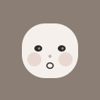

# Avataurus — Visual Style Proposals (v2)

Three face-based avatar styles. All use modern muted color palettes (slate, stone, sage, taupe — no bright primaries). Every avatar is clearly recognizable as a face suitable for default profile pictures.

Seeds: alice, bob, charlie, dave, eve, frank, grace, heidi, ivan, judy

---

## C-v2: "Minimal Face"

Clean, simple faces on muted backgrounds. Inspired by facehash.dev but with better proportions, modern palette, and subtle cheek blush for warmth.

- Varied face shapes (circle, oval, rounded rect)
- Multiple eye styles (dots, open circles, happy arcs, ovals)
- Subtle noses, varied mouths
- Warm cheek blush
- Controllable palette via `colors` option

| alice | bob | charlie | dave | eve |
|---|---|---|---|---|
|  |  |  |  |  |

| frank | grace | heidi | ivan | judy |
|---|---|---|---|---|
|  |  |  |  |  |

---

## E: "Geometric Face"

Bauhaus-inspired faces with angular features — diamond eyes, triangular noses, geometric shapes — but still unmistakably faces.

- Geometric face shapes (hexagon, trapezoid, rounded square)
- Diamond, square, triangle eye shapes
- Angular noses and mouths
- Clean lines, modern feel

| alice | bob | charlie | dave | eve |
|---|---|---|---|---|
|  |  |  |  |  |

| frank | grace | heidi | ivan | judy |
|---|---|---|---|---|
|  |  |  |  |  |

---

## F: "Soft Face"

Rounded, friendly faces like Slack/Notion defaults. Emphasis on expressive eyes, subtle gradients, and warmth.

- Soft rounded face shapes
- Expressive eyes with pupils and highlights
- Subtle background gradient for depth
- Always-present cheek blush
- Warm, approachable, professional

| alice | bob | charlie | dave | eve |
|---|---|---|---|---|
|  |  |  |  |  |

| frank | grace | heidi | ivan | judy |
|---|---|---|---|---|
|  |  |  |  |  |

---

## Color Palette

All proposals share the same palette philosophy:
- **Background**: Muted mid-tones (slate, stone, zinc, sage, taupe, dusty rose)
- **Face**: Warm off-white (#f5f0eb / #f7f3ee)
- **Features**: Near-black (#2d2a27 / #35302b)
- **Blush**: Subtle dusty pink/rose

No bright primaries. No saturated colors. Professional and modern.
