# Visual Quality Proposals for Avataurus

Four directions to explore. Each has 5 sample SVGs generated from seeds: `alice`, `bob`, `charlie`, `dave`, `eve`.

All proposals share these improvements over current:
- **Square viewBox** (no rounded clipping — let users handle that with CSS)
- **Better contrast** (avatar vs background)
- **Fewer colors** per avatar
- **Deterministic** (same input → same output)

---

## A) Geometric Dino 🦕

**Concept:** Keep the dino identity but make it angular and mature. Low-poly aesthetic with sharp edges, flat colors, and muted earthy tones.

### Samples

| alice | bob | charlie | dave | eve |
|-------|-----|---------|------|-----|
| 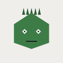 |  | 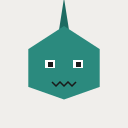 | 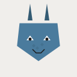 | 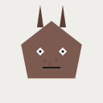 |

### Key Changes
- Head shapes are **polygons** (pentagons, hexagons, shields) instead of circles/ellipses
- Spikes/horns are sharp triangles
- Eyes use geometric shapes (diamonds, squares, slits) — reptilian feel
- Only 2 colors per avatar (main + dark variant) on neutral gray background
- Optional scale/stripe patterns on the face

### Pros
- ✅ Keeps the dino brand — recognizable identity for avataurus
- ✅ Looks more mature/professional than current rounded style
- ✅ Good contrast (colored dino on light gray)
- ✅ Distinct from competitors (no one does geometric dinos)

### Cons
- ❌ Still a "character" avatar — may not fit all professional contexts
- ❌ More complex SVG than abstract approaches
- ❌ Angular shapes can look harsh at very small sizes

---

## B) Abstract Shapes 🔶

**Concept:** Drop the dino theme entirely. Composed geometric shapes with radial gradients for subtle 3D depth. Inspired by boring-avatars' marble/bauhaus styles.

### Samples

| alice | bob | charlie | dave | eve |
|-------|-----|---------|------|-----|
| 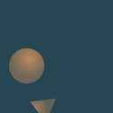 | 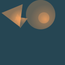 |  | 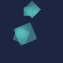 | 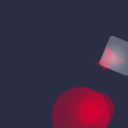 |

### Key Changes
- No face/character at all — pure geometric composition
- 3-6 overlapping shapes (circles, rectangles, triangles, diamonds)
- 5-color curated palettes (borrowed from proven design palettes)
- Radial gradients on each shape for subtle 3D effect
- Global rotation for additional variety

### Pros
- ✅ Universally professional — works in any context
- ✅ Beautiful at any size
- ✅ Proven concept (boring-avatars, Gravatar)
- ✅ Lots of visual variety from simple rules

### Cons
- ❌ Loses all dino identity — "avataurus" name becomes meaningless
- ❌ Harder to distinguish at a glance in a list
- ❌ Many competitors already do this well

---

## C) Minimal Face 😐

**Concept:** Simple face on a bold colored background. Facehash.dev-inspired but with more geometric variety. The personality comes from shape combinations, not color overload.

### Samples

| alice | bob | charlie | dave | eve |
|-------|-----|---------|------|-----|
|  |  | 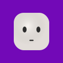 |  |  |

### Key Changes
- Warm off-white face on bold single-color background
- Radial gradient overlay for subtle 3D shading on face
- Eyes are the main differentiator (8 types: dots, circles, lines, ovals, etc.)
- Simple nose (4 types including none) and mouth (8 types)
- Optional eyebrows for expression
- Only 3 colors total: background, face, features

### Pros
- ✅ Most polished/professional look
- ✅ Humans naturally recognize faces → high distinctiveness
- ✅ Excellent contrast (bold bg + light face)
- ✅ Minimal SVG output
- ✅ Scales beautifully from 16px to 512px

### Cons
- ❌ Very similar to facehash.dev — less original
- ❌ Loses dino identity completely
- ❌ Face variations may feel limited over time

---

## D) Identicon+ 🔲

**Concept:** Grid-based symmetrical patterns. Single color on near-white. Like GitHub/minidenticons but with shape variety (squares, circles, or diamonds).

### Samples

| alice | bob | charlie | dave | eve |
|-------|-----|---------|------|-----|
|  |  | 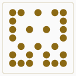 | 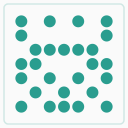 |  |

### Key Changes
- 7×7 grid with horizontal symmetry
- Hash bits directly control which cells are filled
- Three shape modes: rounded squares, circles, or diamonds
- Single color per avatar from a curated palette
- Optional subtle border frame
- Ultra-minimal SVG output

### Pros
- ✅ Lightest SVG output of all proposals
- ✅ Instantly recognizable pattern (familiar from GitHub)
- ✅ Perfect symmetry is visually pleasing
- ✅ Maximum contrast (single color on white)
- ✅ Dead simple code — easy to maintain

### Cons
- ❌ Least "personality" — feels generic
- ❌ No face or character to connect with
- ❌ Very similar to existing identicon libraries
- ❌ Limited differentiation at small sizes

---

## Recommendation

**C (Minimal Face)** or **A (Geometric Dino)** are the strongest options:

- Pick **C** if you want maximum polish and universal appeal
- Pick **A** if you want to keep the dino brand and stand out from competitors
- Consider **A + C hybrid**: geometric dino face on a bold background with the minimal face's color approach (3 colors, strong contrast, 3D shading)

All generator scripts are in `proposals/` and are self-contained. Run `node proposals/generate-all.mjs` to regenerate samples.
